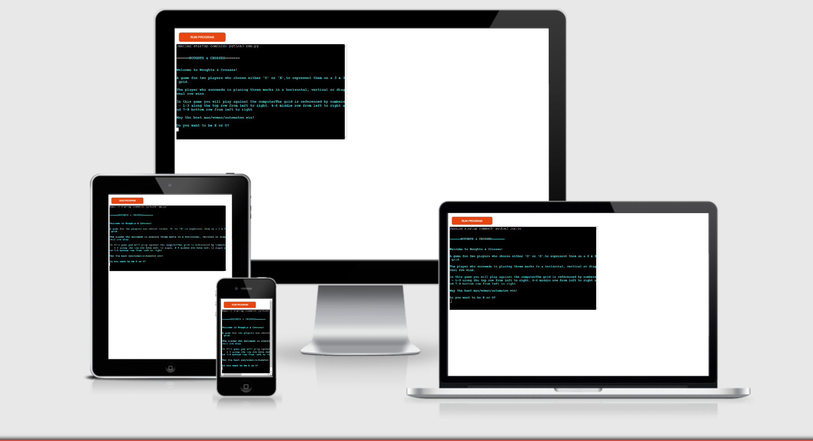

# Noughts & Crosses

Noughts and Crosses", also called "Tic-tac-toe" or "Hugs and Kisses", is an ancient game that billions of people have played over the course of history. While some experts believe the game dates back to the ancient Egyptians, others believe it evolved from an ancient Roman game called Terni Lapilli.

The modern game is played on a nine-square grid created by drawing lines to create three horizontal rows and three vertical columns. Players alternate marking the squares with Xs and Os, trying to achieve three marks in a row either horizontally, vertically, or diagonally.

[Click here to go to the live website](https://love-noughts-and-crosses.herokuapp.com/)

## Table of contents 

1. [Project Goals](#project-goals)
2. [User Experience (UX)](#user-experience-UX)
3. [Features](#features)
4. [Technology](#technology)
5. [Testing](#testing)
6. [Improvements](#improvements)
7. [Deployment](#deployment)
8. [Credits](#credits)

***

## Project Objectives

I wanted to create a game where the player plays against the computer, or AI, that would intelligently respond to the player's moves.

The game I chose was noughts and crosses, as it is universally known, relatively easy to play and is a short game, thereby holding the player's attention.

## User Experience (UX)

I wanted the user to have fun pitting their wits against the computer, and wanting to keep playing until they won!

In the first instance the board had to be represented by a pair of vertical and horizontal lines, giving a 3 by 3 grid. Each cell was then referenced numerically, shown below:

The board is numbered in a way that a human would expect, and therefore intutive, i.e. uses human logic on past experience (does not take into account cultural differences i.e. there may be cultures that expect flow from right to left).

The cells are chosen by their corresponding number when a move is made.

The user experiences a fair amount of interaction with the computer in playing out the game.

## Flowchart

The following flowchart was designed using Lucidchart to map out the flow and logic of the program:

## Features

The game starts with a welcome message and instructions on how to play the game.

The player is then asked if they want to be 'X' or 'O', and requires input. 

The game is then started, either by the computer making the first move or the player - as prompted. This is randomly generated.

The moves are required in numeric form (see above board reference).

The player and the computer take turns to make their move, until there is a winner or tie.

The the player is asked if they want to play again.

The game colour is in cyan, rather than the standard white, as it is much easier on the eye.

## Technologies used
### Language Used

* Python3

### Libraries and Programs Used

* GitPod] - used for writing code, committing, and then pushing to GitHub.

* GitHub - used to store the project after pushing.

* Heroku - used to deploy the application.

* PEP8 online check - used to validate the Python code.

* Random - a built in Python library used to ramdomly choose which player went first.

## Testing

Whilst writing and working on the code I used the terminal/console to test it's functionality. I also tested blocks of code in PEP8 at the time of writing.

I then validated the code finally in PEP8 which confirmed that there were no errors.

### Manual Testing
* See table at the end of the Readment document.
<table>
<tr>
<th>Feature</th>
<th>Outcome</th>
<th>Example</th>
<th>Pass/Fail</th>
</tr>
<tr>
<td>Player choice of X or O Input</td>
<td>invalidate an integer</td>
<td></td>
<td>Pass</td>
</tr>
<tr>
<td>Player choice of X or O Input</td>
<td>invalidate a letter that is not X or O</td>
<td></td>
<td>Pass</td>
</tr>
<tr>
<td>Player choice of X or O Input</td>
<td>invalidate empty space</td>
<td></td>
<td>Pass</td>
</tr>
<tr>
<td>Player move Input</td>
<td>invalidate a letter input that is not an integer 1-9</td>
<td></td>
<td>Pass</td>
</tr>
<tr>
<td>Player move Input</td>
<td>invalidate choice of an occupied cell</td>
<td></td>
<td>Pass</td>
</tr>

## Improvements

Whilst the majority of the manual testing was successful, there is an improvement that can be made at the end game. The program behaved as it should when entering the 'y' and 'n' input for wanting to play again or not, however, it woul end the game with the exit message when entering anything other than 'y' or 'n'. Unfortunately, I did not have time to address this are due to the lack of time.

The other area of improvement I did want to make was providing invalid messages when incorrect input of data was made. Again, it was due to a lack of time that prevented me from addressing this.

## Deployment

The application has been deployed to Heroku as follows:
1. Created a repository in GitHub
2. Code written using Gitpod - committed and pushed to GitHub.
3. At Heroku's website - from the dashboard "Create new app".
4. Enter "App name" and "Choose region" and then "Create app".
5. Go to "Config Vars" under the "Settings" tab.
6. Click on "Reveals Config Vars" and the Config Var, KEY: PORT and VALUE: 8000.
7. Go to "Buildpacks" section and click "Add buildpack".
8. Select "python" and "Save changes", select "nodejs" as well using same process.
9. Go to "Deployment method", under the "Deploy" tab select "GitHub" and "Connect to GitHub".
10. Go to "Connect to GitHub" section and "Search" the repository to be deployed.
11. Click "Connect" next to the repository name.
12. Choose "Automatic deploys" or "Manual deploys" to deploy your application. I chose automatic, so that any changes I made to the code would be picked up by Heroku.
13. Went back to GitHub, and selected settings of the repository to be deployed.
14. Selected pages, then chose main branch, saved and successfully published in GitHub aswell. This allowed me to carry on working on my code and at the same time updating the deployed project in Heroku.

## Credits

* I watched many Youtube clips of both tic-tac-toe and battelships for their similarities in code.

* Al Sweigart and Christian Thompson - guidance in programming.

* Marcel Mulder for his support and guidance throughout the process.

